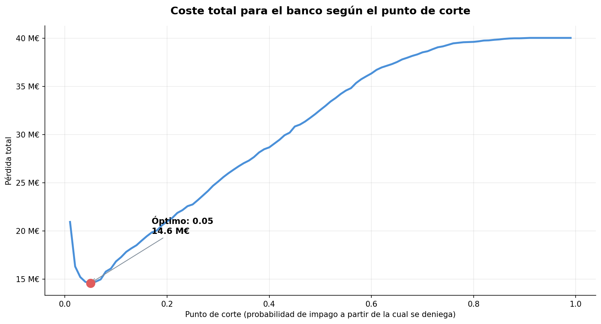
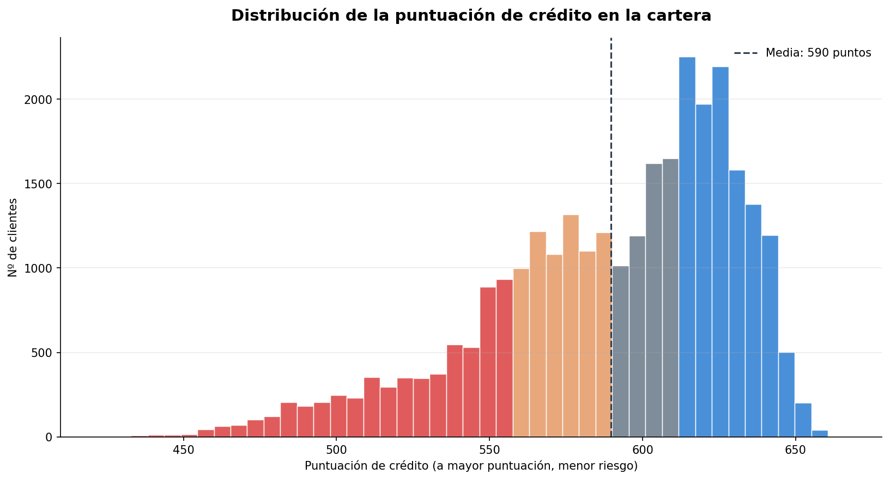

[🇬🇧 English version](README.md)

# Scorecard de Riesgo de crediticio

Proyecto de scoring de riesgo crediticio, desde las solicitudes en bruto hasta un **scorecard** y una **política de concesión calibrada en euros**.

El proyecto responde a la pregunta que hace de verdad un comité de riesgos - no *"¿cuánto acierta el modelo?"* sino **"¿cuánto dinero nos ahorra?"**

---

## El problema

Toda entidad que concede crédito se enfrenta al mismo dilema: aprobar al máximo número de clientes solventes evitando a quienes no devolverán el dinero. Ambos errores cuestan, pero **no lo mismo**:

| Error | Consecuencia | Coste asumido |
|---|---|---|
| Aprobar a un futuro moroso | Capital no recuperado | **20.000 €** |
| Rechazar a un buen cliente | Margen no ganado | **1.000 €** |

Esa asimetría 20:1 es la idea central del proyecto: implica que el umbral óptimo **no** es el 0,5 por defecto, y que puede deducirse en lugar de fijarse a ojo.

---

## Resultados

| Métrica | Valor |
|---|---|
| Modelo | LightGBM (afinado con `RandomizedSearchCV`) |
| AUC-ROC | **0,86** |
| Umbral óptimo (minimiza coste) | **0,05** |
| Reducción de pérdida frente a no filtrar | **63%** |
| Cartera | ~150.000 solicitudes, 6,7% de mora grave |






**Hallazgos clave**

- **El modelo mira lo que miraría un analista.** Las dos señales que más pesan son cuánto crédito tiene consumido el cliente y si ya se ha retrasado en pagos.
- **El límite está en los datos, no en el modelo.** Por mucho que se afine, el rendimiento se queda en 0,86. Para mejorar haría falta saber cómo se comporta el cliente con *otras* entidades (la CIRBE del Banco de España).
- **Conviene ser más estricto de lo que parece.** Como un impago cuesta 20 veces más que perder a un buen cliente, sale a cuenta rechazar de más antes que arriesgarse a aprobar de menos.

---

## Fases del proyecto

**`01_preprocesado_eda.ipynb` - Diagnóstico de cartera y calidad del dato**
Análisis del desbalanceo, detección y tratamiento de errores de registro (ratios de deuda imposibles, códigos de mora mal grabados, edades inválidas), gestión de valores ausentes, análisis de correlaciones e identificación de posibles variables explicativas.

**`02_modelado.ipynb` - Motor de decisión**
Baseline con regresión logística → feature engineering (9 indicadores de solvencia y comportamiento de pago) → comparativa de modelos (Logística / Random Forest / LightGBM) → optimización de hiperparámetros → **calibración del umbral por coste económico** → explicabilidad con SHAP.

**`03_scorecard_negocio.ipynb` - Scorecard e impacto de negocio**
Transformación de PD a puntuación 300–850 (points-to-double-the-odds), segmentación en cinco tramos de rating validados contra la morosidad observada, y simulación de cartera que cuantifica en euros la pérdida evitada.

---

## Aspectos técnicos destacables

- **El punto de corte se calcula, no se elige a ojo.** En vez de quedarse con el 0,5 por defecto, se prueban todos los cortes posibles y se busca el que menos dinero le cuesta al banco. Los costes están puestos como variables, así que quien tenga las cifras reales solo tiene que cambiarlas y volver a ejecutar.
- **La puntuación funciona como la de cualquier scorecard bancario.** Cada 20 puntos de más significa la mitad de riesgo, en cualquier punto de la escala. Eso permite comparar clientes de forma directa: 40 puntos de diferencia es siempre lo mismo, tanto entre 500 y 540 como entre 700 y 740.
- **La puntuación está contrastada con la realidad.** No basta con que el modelo ordene bien; hay que comprobar que acierta en cuánto. Al comparar lo que predice con lo que pasó, los cinco tramos coinciden con menos de 0,25 puntos de desvío.
- **Se puede explicar por qué se deniega un crédito.** Con SHAP se ve por qué motivo se tomó cada decisión, en línea con las regulaciones bancarias y de herramientas de IA.

---

## Estructura de carpetas

```
├── 01_preprocesado_eda.ipynb      # Calidad del dato y análisis exploratorio
├── 02_modelado.ipynb              # Modelado y calibración del umbral
├── 03_scorecard_negocio.ipynb     # Scorecard y simulación de negocio
├── data/                          # Dataset y modelo generado
├── images/                        # Gráficos usados en este README
└── requirements.txt
```

## Ejecución

```bash
git clone https://github.com/adrsabin/credit-risk-scorecard.git
cd credit-risk-scorecard
pip install -r requirements.txt
```

Ejecuta los notebooks en orden. Cada fase guarda en `data/` los datos necesarios para la siguiente fase.

**Datos:** [Give Me Some Credit](https://www.kaggle.com/c/GiveMeSomeCredit) - conjunto de referencia del sector para prototipar sistemas de admisión sin exponer datos reales de clientes.

---

## Limitaciones

- Datos de una sola entidad, sin información de bureau externo, lo que limita el poder discriminante alcanzable.
- El recorte de valores atípicos y la imputación se aplican antes del split train/test. El impacto es menor dado el tamaño muestral, pero en producción estos parámetros deben ajustarse solo sobre entrenamiento.
- Los supuestos de coste son orientativos y deben validarse con las cifras reales de pérdida y margen de la entidad.

---

**Adrian Sabin Pelayo** · Data Science | Riesgo de Crédito
