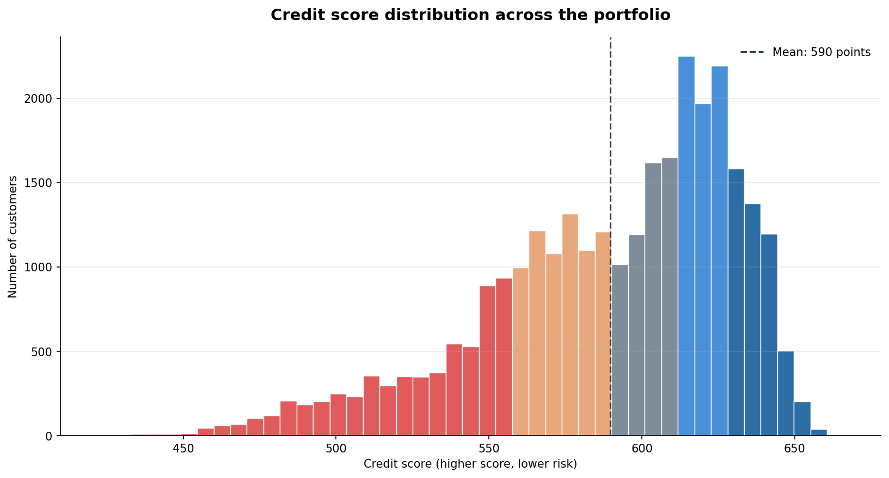

[🇪🇸 Versión en español](README.es.md)

# Risk Credit Scoring

A credit scoring project that goes from raw loan applications to a **scorecard** and a **lending policy calibrated in euros**.

It answers the question a risk committee actually asks - not *"how accurate is the model?"* but **"how much money does it save us?"**

> The notebooks are written in Spanish, as the project is framed around the Spanish retail banking context. Everything you need to assess it is summarised below.

---

## The problem

Every lender faces the same dilemma: approve as many solvent customers as possible while keeping out those who won't pay the money back. Both mistakes cost money, but **not the same**:

| Mistake | Consequence | Assumed cost |
|---|---|---|
| Approving a future defaulter | Capital never recovered | **€20,000** |
| Rejecting a good customer | Margin never earned | **€1,000** |

That 20:1 asymmetry is the core idea of the project: it means the optimal cut-off is **not** the default 0.5, and that it can be worked out rather than guessed.

---

## Results

| Metric | Value |
|---|---|
| Model | LightGBM (tuned with `RandomizedSearchCV`) |
| AUC-ROC | **0.86** |
| Optimal cut-off (minimises cost) | **0.05** |
| Loss reduction vs. approving everyone | **63%** |
| Portfolio | ~150,000 applications, 6.7% serious delinquency rate |




**Key findings**

- **The model looks at what an analyst would look at.** The two strongest signals are how much of their credit the customer has already used and whether they have missed payments before.
- **The ceiling is the data, not the model.** No amount of tuning pushes performance past 0.86. Getting further would mean knowing how the customer behaves with *other* lenders (the Bank of Spain's CIRBE register).
- **It pays to be stricter than you'd think.** Since a default costs 20 times more than losing a good customer, it works out cheaper to reject too many than to risk approving too few.

---

## Project phases

**`01_preprocesado_eda.ipynb` - Portfolio diagnosis and data quality**
Class imbalance analysis, detection and treatment of recording errors (impossible debt ratios, mis-coded delinquency values, invalid ages), missing value handling, correlation analysis and identification of candidate explanatory variables.

**`02_modelado.ipynb` - Decision engine**
Logistic regression baseline → feature engineering (9 solvency and repayment-behaviour indicators) → model comparison (Logistic / Random Forest / LightGBM) → hyperparameter tuning → **cut-off calibrated on economic cost** → SHAP explainability.

**`03_scorecard_negocio.ipynb` - Scorecard and business impact**
PD converted to a 300–850 score (points-to-double-the-odds), segmentation into five rating bands validated against observed delinquency, and a portfolio simulation quantifying the loss avoided in euros.

---

## Technical highlights

- **The cut-off is calculated, not eyeballed.** Instead of settling for the default 0.5, every possible cut-off is tested and the one that costs the bank least is selected. The costs are set as variables, so anyone with the real figures just has to change them and re-run.
- **The score behaves like any banking scorecard.** Every 20 extra points means half the risk, anywhere on the scale. That makes customers directly comparable: a 40-point gap always means the same thing, whether it's between 500 and 540 or between 700 and 740.
- **The score is checked against reality.** It isn't enough for the model to rank customers correctly; it has to get the magnitude right too. Comparing what it predicted with what actually happened, all five bands match within 0.25 percentage points.
- **You can explain why a loan was declined.** SHAP shows what drove each decision, in line with banking regulation and AI governance requirements.

---

## Repository structure

```
├── 01_preprocesado_eda.ipynb      # Data quality and exploratory analysis
├── 02_modelado.ipynb              # Modelling and cut-off calibration
├── 03_scorecard_negocio.ipynb     # Scorecard and business simulation
├── data/                          # Dataset and generated model
├── images/                        # Charts used in this README
└── requirements.txt
```

## Running it

```bash
git clone https://github.com/adrsabin/credit-risk-scorecard.git
cd credit-risk-scorecard
pip install -r requirements.txt
```

Run the notebooks in order. Each phase writes to `data/` what the next one needs.

**Data:** [Give Me Some Credit](https://www.kaggle.com/c/GiveMeSomeCredit) - an industry benchmark for prototyping admission systems without exposing real customer data.

---

## Limitations

- Single-lender data with no external bureau information, which caps the discriminatory power achievable.
- Outlier capping and imputation are applied before the train/test split. The impact is minor given the sample size, but in production these parameters should be fitted on training data only.
- The cost assumptions are illustrative and should be validated against the institution's actual loss and margin figures.

---

**Adrian Sabin Pelayo** · Data Science | Credit Risk
